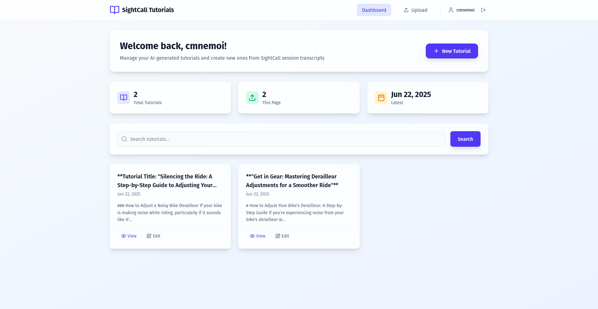
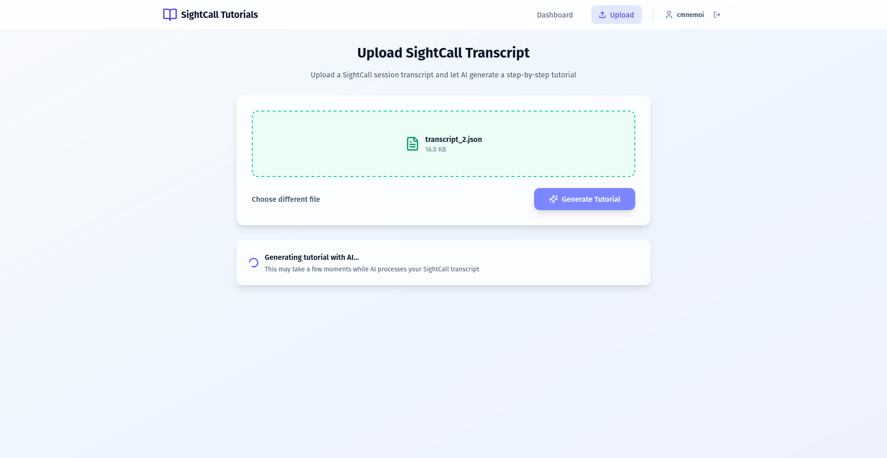
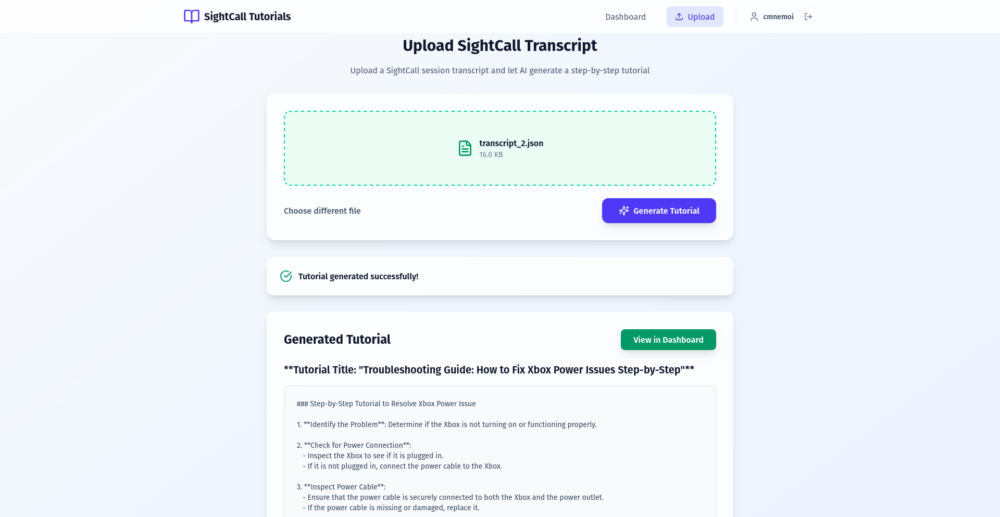
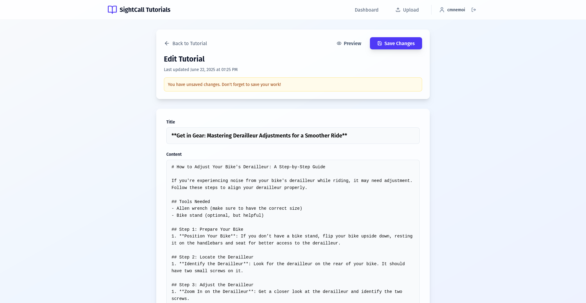

# SightCall Transcripts to Tutorial

[](https://github.com/cmnemoi/sightcall_transcript_to_tutorial/actions/workflows/backend_continuous_integration.yaml)
[](https://github.com/cmnemoi/sightcall_transcript_to_tutorial/actions/workflows/frontend_continuous_integration.yaml)
[](https://github.com/cmnemoi/sightcall_transcript_to_tutorial/actions/workflows/create_github_release.yaml)
[](https://codecov.io/gh/cmnemoi/sightcall_transcript_to_tutorial)

An app to generate tutorials from SightCall support transcripts with OpenAI.



# Installation

This project is optimized to be launched on UNIX-like systems.

## Prerequisites

### Mandatory

- [Python **3.13**](https://www.python.org/downloads/)
- [Node.js 22+](https://nodejs.org/en/download/)

### Optional

- [Docker Compose](https://docs.docker.com/compose/install/)
- [uv](https://docs.astral.sh/uv/getting-started/installation/) 
- [curl](https://curl.se/download.html)
- [make](https://www.gnu.org/software/make/)

### Auto installation script

If you have all dependencies installed:

- Run the following command : `curl -sSL https://raw.githubusercontent.com/cmnemoi/sightcall_transcript_to_tutorial/refs/heads/main/clone-and-install | bash`
- Setup the environment variables in `backend/.env` :
   - Modify `GITHUB_CLIENT_ID` - You can get one [here](https://github.com/settings/developers) after creating an new OAuth app
   - Modify `GITHUB_CLIENT_SECRET` - You can get one [here](https://github.com/settings/developers) after creating an new OAuth app
   - Modify `OPENAI_API_KEY` - You can get one [here](https://platform.openai.com/account/api-keys) after creating an new account
- Run `make` to rebuild the app and run it

### I don't have all the dev dependencies, and I just want to run the app

- Clone the repository and move inside : `git clone https://github.com/cmnemoi/sightcall_transcript_to_tutorial.git && cd sightcall_transcipt_to_tutorial`
- Setup your environment variables in `backend/.env` :
  - `cp backend/.env.example backend/.env`
  - Modify `GITHUB_CLIENT_ID` - You can get one [here](https://github.com/settings/developers) after creating an new OAuth app
  - Modify `GITHUB_CLIENT_SECRET` - You can get one [here](https://github.com/settings/developers) after creating an new OAuth app
  - Modify `OPENAI_API_KEY` - You can get one [here](https://platform.openai.com/account/api-keys) after creating an new account

- If you have Docker Compose, run `docker compose up`
- If you don't have Docker Compose :
  - Install backend:
```
cd backend
python3 -m venv .venv
source .venv/bin/activate
pip install -r requirements.txt
uvicorn sightcall_transcript_to_tutorial.main:app --host localhost --port 8000
```

  - Install frontend:
```
cd frontend
npm install
npm run dev
```

# Testing

Run `make test` to run the tests.

You have sample JSON transcripts in [`data`](./data) to test the application manually.

# License

The source code of this repository is licensed under the [AGPL-3.0-or-later License](LICENSE).

# Screenshots




